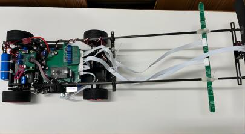

# STC32_ElectroMagnetCar

---

Packages of **STC32G_ElectroMagnetCar** Repo

`Project` 工程文件夹

`Libraries` 逐飞库文件

`pic` 存放图片

---

**This is a repo for 18th Smart Car Race, dedicated to myself and my beloved.** 

We got **Second Prize in Provincial level, ElectroMagnet Group**.

## 1. Author 🙆‍♂️🙆‍♀️

The project developed by: 

[MenHimChan (WenQianChen) (github.com)](https://github.com/MenHimChan)

[YWpepper (wen.Yan) (github.com)](https://github.com/YWpepper)

## 2. Hardware Platform 🕹

The project is based on the following configs:

+ STC32G12K128 (SeekFree - v1.0 - coreboard - 64pin)
+ C - Car Model
+ SeekFree libraries v1.4.5 (can be found in `Libraries`)
+ Keil - C251

## 3. Car Appearance 🚗

## 4. Part of our PCB projects 🔨

Here is the motherboard projects, feel free to use if needed:

+ [电磁智能车运放+DRV8701电机驱动 - 嘉立创EDA开源硬件平台 (oshwhub.com)](https://oshwhub.com/menhimchan/zhi-neng-ju)
+ [18届负压电磁智能车主板 - 嘉立创EDA开源硬件平台 (oshwhub.com)](https://oshwhub.com/menhimchan/zhi-neng-ju-zhu-ban)

[18届负压电磁智能车主板 - 嘉立创EDA开源硬件平台 (oshwhub.com)](https://oshwhub.com/menhimchan/zhi-neng-ju-zhu-ban)

## 5. VedioClip 🎞

[18届智能车华南赛区负压电磁省二作品展示](https://www.bilibili.com/video/BV1UP41167nP)

